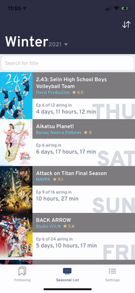
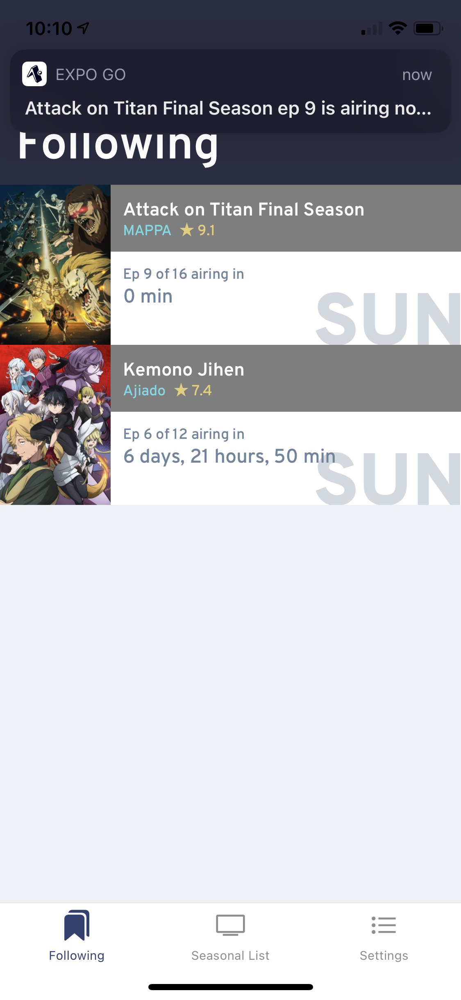

<!-- LOGO -->

    
    <h3 align="center">aniMinder</h3>
    

        An IOS app that sends notifications when seasonal anime shows begin airing
    

<!-- ABOUT -->
## About
aniMinder allows users to follow airing shows in the current season of anime. Following shows also triggers the app to schedule a notification that triggers when the show begins airing. The airing times are gathered from the [AniList API](https://anilist.gitbook.io/anilist-apiv2-docs/) and stored in the backend database which is updated every hour. Users are also given the option to delay the notification so it may, for example, trigger an hour before the show starts.

### Screenshots
#### Following and unfollowing an anime
 

#### Searching and sorting
 

#### Hiding finished shows

#### Getting a notification

### Built With
- [Mobile App](/mobile)
    - React Native
    - Expo
- [Backend](/backend-aws)
    - Node